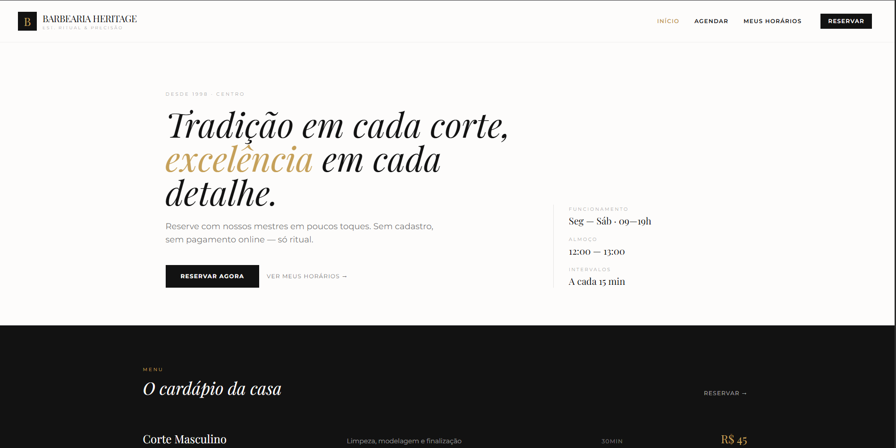

# Barbearia Heritage — Sistema de Agendamento

Aplicação frontend para agendamento de barbearia. Cliente escolhe serviço, profissional, data e horário; o sistema valida disponibilidade e persiste os agendamentos no `localStorage` (sem backend).

Desafio técnico em React + TypeScript + Tailwind.



## Como executar

Requisitos: Node 20+.

```bash
npm install
npm run dev
```

Aplicação em http://localhost:5173

Outros scripts:

```bash
npm run build     # build de produção
npm run preview   # serve o build localmente
npm run lint      # ESLint
```

## Stack

- **Vite + React 19 + TypeScript** (strict mode)
- **Tailwind CSS v3** com tema custom (paleta paper/ink/gold, Playfair Display + Montserrat)
- **Zustand** com `persist` middleware para o store de agendamentos
- **React Router v6** para navegação entre três páginas
- Formatação de datas via `Intl.DateTimeFormat` (sem libs adicionais; `date-fns` foi descartado para manter o bundle enxuto)

## Arquitetura

Organização feature-based, com separação rígida entre **lógica pura** (zero React, testável em isolamento) e **UI** (consumindo dados via hooks/store).

```
src/
  domain/                 tipos e dados estáticos (sem React)
    types.ts
    services.ts           5 serviços do catálogo
    professionals.ts      3 profissionais e os serviços que executam
    schedule.ts           OPENING/CLOSING/LUNCH em minutos do dia
  features/
    booking/
      logic/              funções puras testáveis
        overlap.ts        intervalsOverlap, crossesLunch
        slots.ts          generateDaySlots, getAvailableSlots
        assignment.ts     pickProfessionalForAny
        validation.ts     validateAppointment (guarda final)
      components/         UI do wizard
        BookingFlow.tsx
        BookingControls.tsx
        BookingSidebar.tsx
        SlotsGrid.tsx
        BookingSuccess.tsx
    appointments/
      components/
        AppointmentsList.tsx
      store.ts            Zustand + persist em localStorage
  shared/
    components/
      SiteShell.tsx       SiteHeader, SiteFooter
    lib/
      time.ts             hhmmToMinutes, minutesToHHmm
      date.ts             toIsoDate, parseIsoDate, isSameDay
  pages/
    HomePage.tsx
    BookingPage.tsx
    AppointmentsPage.tsx
  App.tsx                 BrowserRouter + 3 rotas
  main.tsx
  index.css               @tailwind layers + base
```

**Regra de ouro:** lógica de negócio (cálculo de slots, validação das 5 regras, atribuição "qualquer profissional") vive em `features/booking/logic/` como funções puras. Componentes consomem; não duplicam regra.

## Regras de negócio

| Item | Valor |
| --- | --- |
| Funcionamento | Seg–Sáb, 09:00–19:00 |
| Almoço bloqueado | 12:00–13:00 |
| Intervalo de slot | 15 minutos |
| Horizonte de agendamento | 30 dias |

Catálogo de serviços e profissionais que executam cada um:

| Serviço | Duração | Preço | Realizado por |
| --- | ---: | ---: | --- |
| Corte Masculino | 30 min | R$ 45 | Carlos, João, Marina |
| Barba | 20 min | R$ 30 | Carlos, João |
| Corte + Barba | 45 min | R$ 65 | Carlos |
| Hidratação | 40 min | R$ 55 | João, Marina |
| Corte + Hidratação | 60 min | R$ 80 | João |

Um horário é inválido se:
1. **Sobrepõe** outro agendamento do profissional (parcial ou total).
2. A duração do serviço **invade o almoço**.
3. A duração **não cabe antes do próximo agendamento** (matematicamente equivalente a 1).
4. A duração **ultrapassa 19:00**.
5. **Horário já passou** (quando a data é hoje).

"Qualquer profissional": mostra horários onde **pelo menos um** profissional elegível está livre; na confirmação, atribui ao que ficaria com **mais slots de 15min livres no dia** após o agendamento. Desempate: ordem alfabética.

## Decisões tomadas

### Modelagem
- **Tempo de dia em minutos desde 00:00** internamente (`9*60`, `12*60`, etc.). Aritmética de intervalos vira `start < end` em vez de comparar strings ou `Date`. Conversão `HH:mm ↔ minutos` só nas bordas.
- **`endTime` persistido** em `Appointment` (denormalização) — duração de serviços é estática, e simplifica o cálculo de overlap.
- **`ProfessionalChoice = ProfessionalId | 'any'`** apenas no estado do wizard. Após confirmar, `Appointment.professionalId` é sempre um ID concreto.
- **`PROFESSIONALS` declarado em ordem alfabética** — o desempate de "qualquer profissional" se apoia na ordem do array.

### Lógica
- A regra "não cabe antes do próximo" é **matematicamente equivalente a overlap** — se o intervalo `[start, start+duração]` cruza o próximo agendamento, é overlap. Implementado como um único check.
- **`validateAppointment` mantida mesmo com a UI filtrando** — defense-in-depth contra inputs adulterados (URL, deep link, futura evolução com formulário direto).
- **`now: Date` é injetado** em todas as funções puras (`getAvailableSlots`, `validateAppointment`). Nada de `new Date()` interno — mantém testabilidade.

### UX
- **Dados do cliente:** nome + telefone (sem validação de formato, foco no fluxo).
- **Listagem global:** mostra todos os agendamentos persistidos (não há autenticação). Separa em "Próximos" e "Histórico" pelo `endTime`.
- **Cancelamento permitido:** botão em cada card; libera o slot do profissional automaticamente.
- **Slots indisponíveis aparecem com strikethrough**, não escondidos — usuário entende visualmente o que está bloqueado.
- **Wizard de 5 passos:** serviço → profissional → data → horário → dados do cliente. Mudar um passo upstream reseta os downstream.
- **Sidebar sticky** com resumo em tempo real + erro de validação + botão confirmar.

### Visual
- Identidade "Heritage" inspirada em template fornecido: paleta paper (`#fdfcfb`) / ink (`#121212`) / gold (`#c5a059`), Playfair Display (italic serif) para títulos, Montserrat para texto. Sem dark mode.
- **Sem bibliotecas de UI** (nada de shadcn/Radix/MUI). Componentes próprios em Tailwind puro.

### Persistência
- **Zustand `persist` middleware** com chave `barbearia:appointments:v1`. O suffix `v1` permite migração futura se o schema mudar.

## Limitações conhecidas

- Sem validação de formato de telefone (qualquer string é aceita).
- Sem testes automatizados — o foco do escopo de 8h foi entregar a funcionalidade e isolar a lógica pura em funções testáveis (a base para testes está pronta).
- Sem internacionalização — strings em pt-BR fixas.
- "Qualquer profissional" usa "número de slots de 15min livres" como métrica de disponibilidade. Outras interpretações (minutos livres totais, maior bloco contíguo) seriam viáveis; a escolhida é estável e intuitiva.
- Sem feedback de toast pós-cancelamento (a remoção da listagem já é suficiente como confirmação visual).

## Verificação manual rápida

Cenário golden path:
1. Home → "Reservar agora" → escolher "Corte + Barba" → "Qualquer um" → uma data → um horário → preencher nome/telefone → "Confirmar agendamento".
2. Conferir tela de sucesso preta com borda dourada.
3. "Ver meus horários" → agendamento aparece em "Próximos".
4. Reload (F5) → agendamento continua lá.
5. Cancelar → some da lista.
6. Voltar para `/agendar` no mesmo dia/horário → slot livre novamente.

Casos de borda:
- Serviço de 60min (Corte + Hidratação) com João, horário 11:30 → riscado (invade almoço).
- Mesmo serviço, horário 18:30 → riscado (ultrapassa 19:00).
- Data "hoje", horários antes da hora atual → riscados.
- Domingos não aparecem no seletor de data.
